<div align="center">

# dotfiles

**A calm, translucent Hyprland desktop on Arch Linux — with its own Wi-Fi, Bluetooth and wallpaper pickers.**


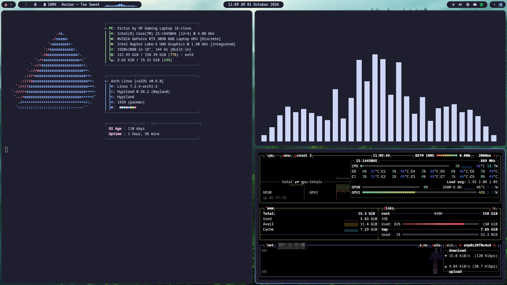

</div>

---

## Highlights

- **Hyprland** with the new Lua config, rounded translucent windows, blur and a Tokyo Night palette.
- **Waybar** with a live **cava** audio visualizer, a **hotspot indicator** that only appears while the hotspot is on, battery, media title and a tray.
- **Notification centre** (swaync) with quick toggles for Wi-Fi, Bluetooth, hotspot, power-saver, caffeine, mic mute, wallpaper and theme pickers, volume and brightness sliders, media controls and Do Not Disturb.
- **Wi-Fi and Bluetooth overlay panels** (GTK4 + layer-shell) that follow the light/dark theme: connect, pair, forget, battery levels and PIN/passkey prompts, all without leaving the desktop.
- **Wallpaper picker** with a thumbnail grid and live filtering, **theme picker** and a one-key **random wallpaper**.
- **tofi** launcher and clipboard history in the same full-screen style.
- **Light / dark switching** across Waybar, notifications, GTK, Neovim and the dock in one command.
- **Hotspot toggle** that reuses your NetworkManager access-point profile, no root needed.
- Terminal and tooling configs: kitty, Neovim, btop, cava, fastfetch, yazi, zsh + powerlevel10k.

## Screenshots

| | |
|---|---|
| 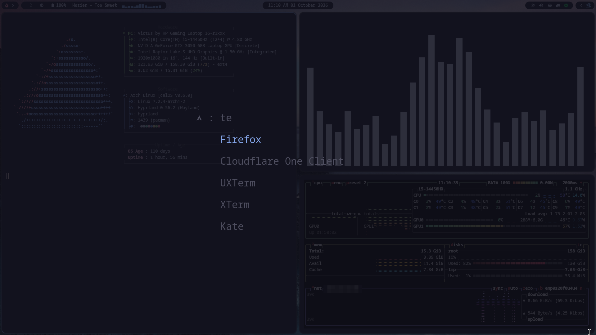 **App launcher** — `Super + A` | 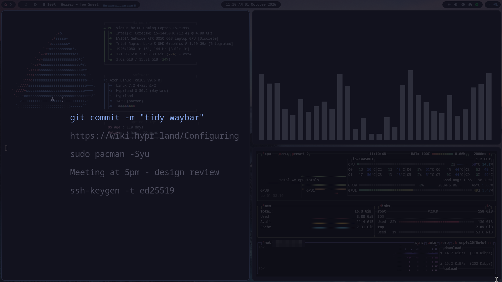 **Clipboard history** — `Super + V` |
| 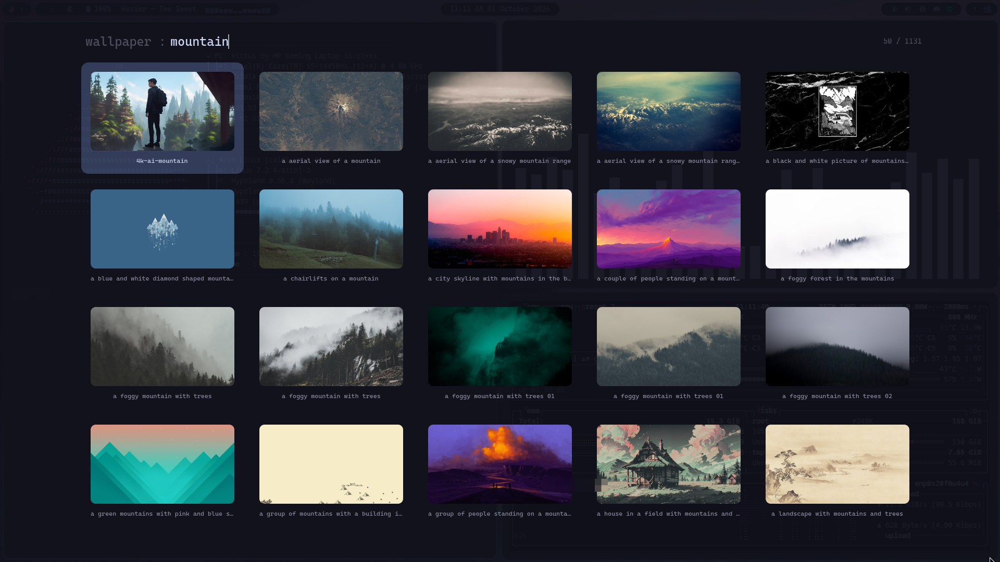 **Wallpaper picker** — `Super + Shift + K` | 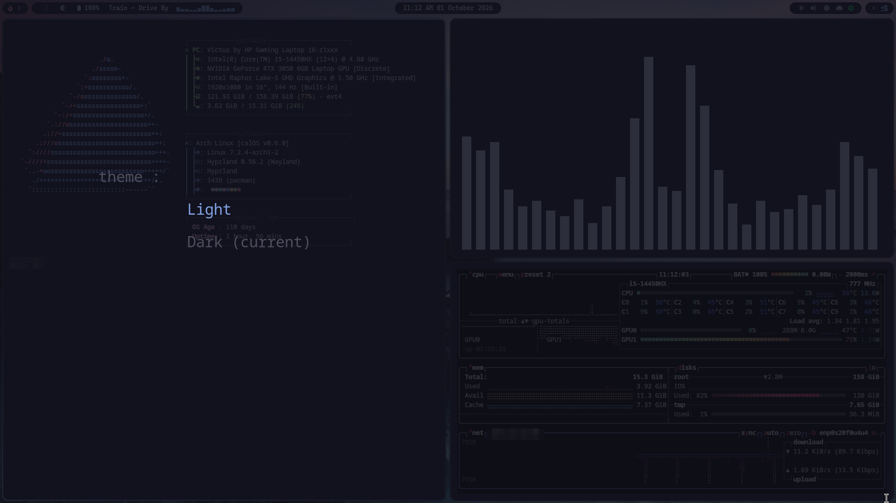 **Theme picker** — `Super + Shift + T` |
| 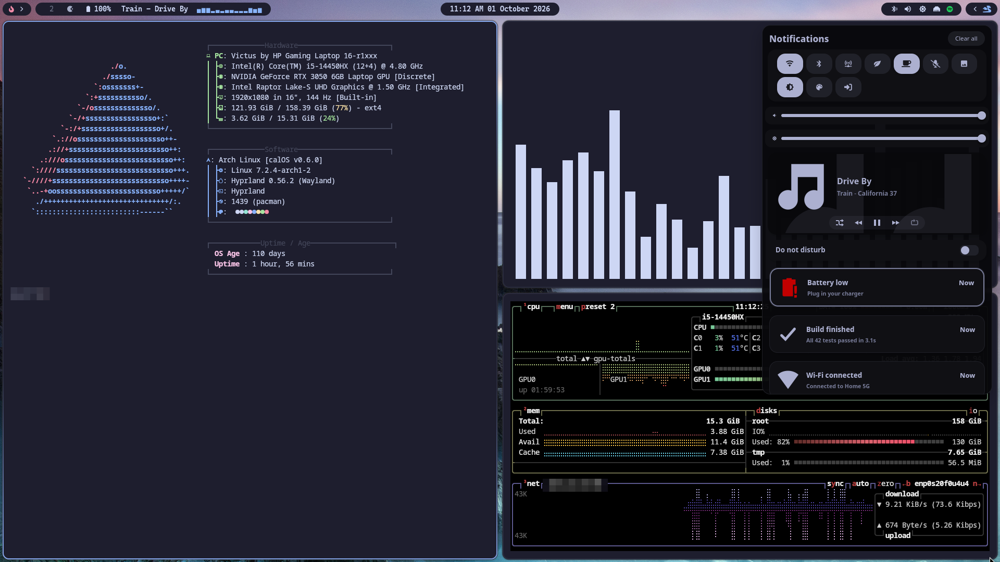 **Notification centre** — `Super + N` | 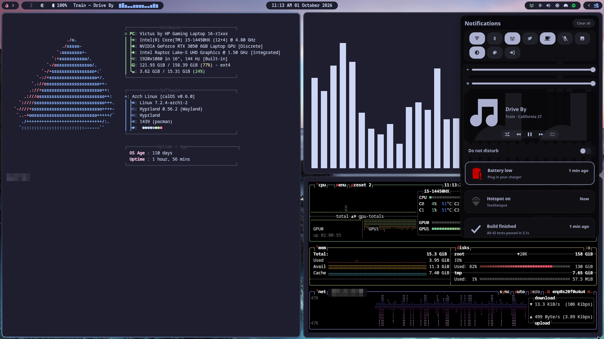 **Hotspot on** — indicator in the bar, toggle in the panel |
| 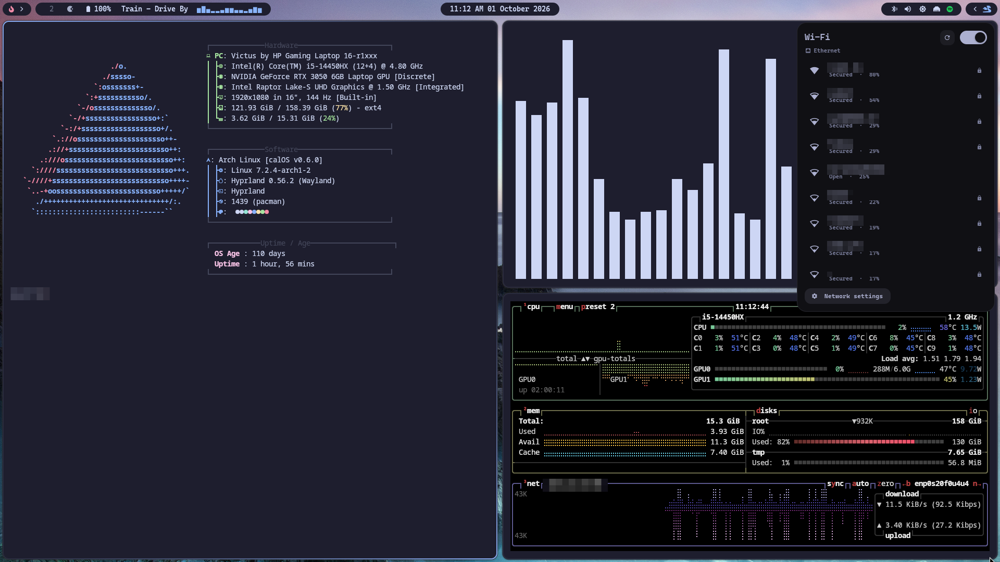 **Wi-Fi panel** — `Super + Ctrl + W` | 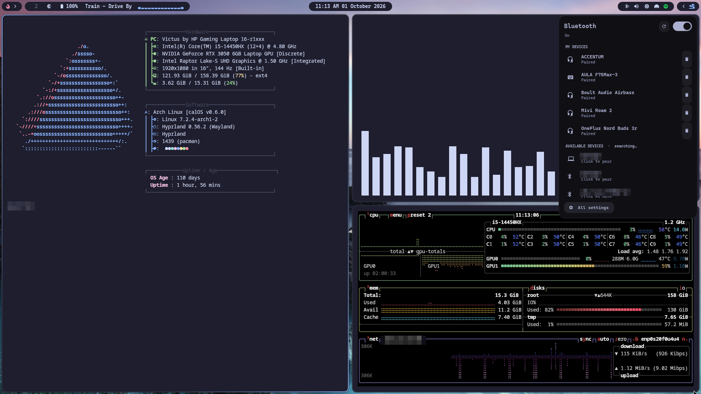 **Bluetooth panel** — `Super + Ctrl + B` |

### Looks

| Dark | Light |
|---|---|
| 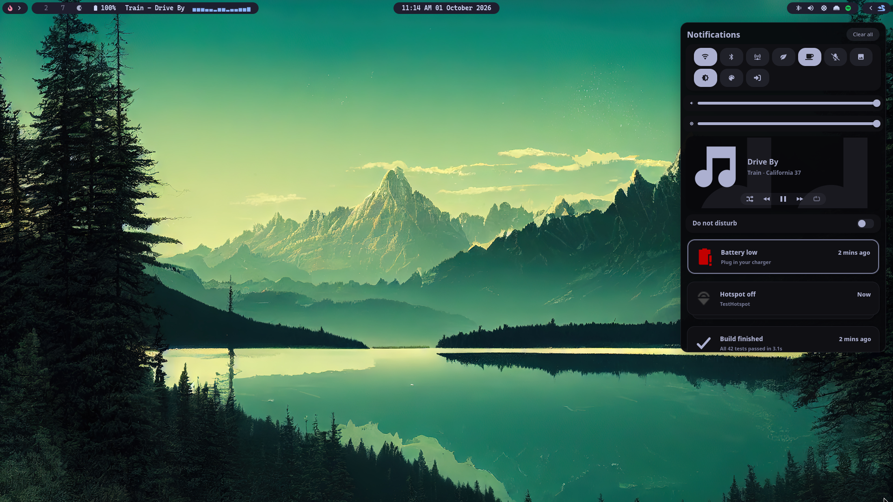 | 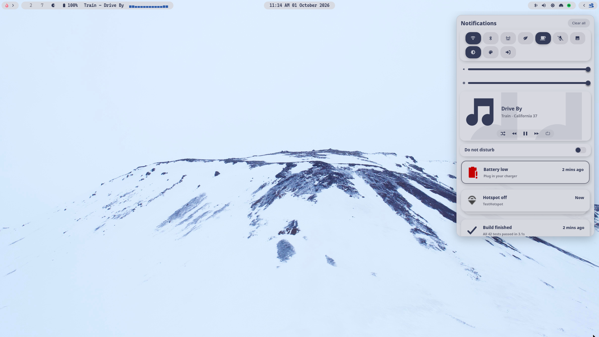 |

| | |
|---|---|
| 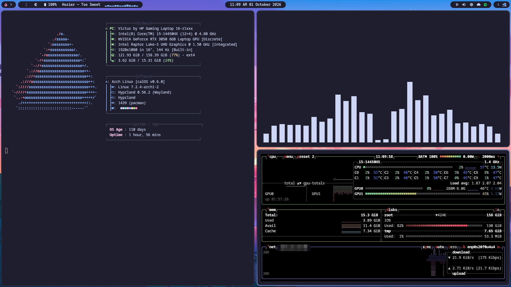 | 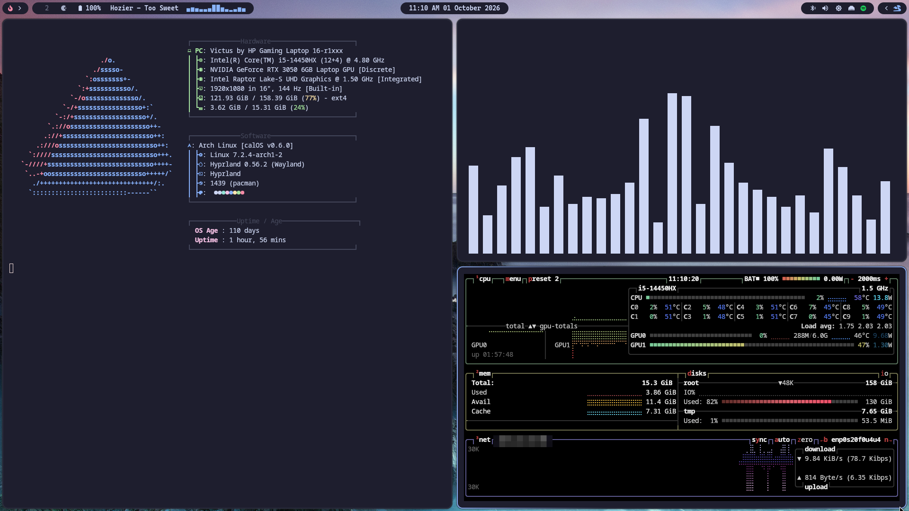 |

### The bar

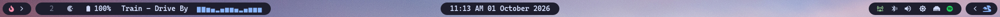

## Install

> Made for **Arch Linux**. Read `install.sh` first, it is short, and run it with `--dry-run` to see what it would do.

```bash
git clone https://github.com/akshajtiwari/dotfiles.git ~/dotfiles
cd ~/dotfiles
./install.sh --all          # packages + symlinks + system files + zsh
```

Or step by step:

```bash
./install.sh --packages     # pacman + AUR packages (uses yay or paru)
./install.sh --link         # symlink the configs into $HOME (existing files are backed up)
./install.sh --system       # /etc files and services (asks for sudo)
./install.sh --system --hardware   # also the hardware specific modprobe files
```

Existing files are moved to `~/.dotfiles-backup/<timestamp>` before anything is linked, and running the installer twice is safe.

Then add some wallpapers to `~/Pictures/Wallpapers/Walls-main/Wallpapers` (or change the path in `hyprland/.config/scripts/` and `hyprland/.local/bin/wallpicker`), log in to Hyprland and press `Super + K`.

## Keybindings

`Super` is the main modifier.

| Keys | Action |
|---|---|
| `Super + T` | Terminal (kitty) |
| `Super + A` | App launcher |
| `Super + V` | Clipboard history |
| `Super + E` | Emoji picker |
| `Super + B` / `C` / `F` / `S` / `O` | Browser / Code / Files / Spotify / Notes |
| `Super + Q` | Close window |
| `Super + W` | Toggle floating |
| `Super + J` | Toggle split direction |
| `Super + ←↑↓→` | Move focus |
| `Super + Shift + ←↑↓→` | Move window |
| `Super + Alt + ←↑↓→` | Resize window |
| `Super + 1…0` | Switch workspace |
| `Super + Shift + 1…0` | Send window to workspace |
| `Super + P` / `Super + Shift + S` | Scratchpad: show / send window |
| `Super + Z` / `X` | Drag / resize with the mouse |
| `Super + K` | Random wallpaper |
| `Super + Shift + K` | Wallpaper picker |
| `Super + Shift + T` | Theme picker (light / dark) |
| `Alt + K` / `Alt + Shift + K` | Random video wallpaper / stop it |
| `Super + Ctrl + W` | Wi-Fi panel |
| `Super + Ctrl + B` | Bluetooth panel |
| `Super + N` | Notification centre |
| `Super + Shift + N` | Do Not Disturb |
| `Super + Ctrl + N` | Clear notifications |
| `Super + Space` | Show / hide the dock |
| `Super + L` | Lock screen |
| `Super + Esc` | Power menu |
| `Print` / `Super + Print` / `Super + Alt + Print` | Screenshot: screen / window / area |

Four-finger swipe changes workspace, and swiping up closes the window.

## Layout

The repo is split into [GNU Stow](https://www.gnu.org/software/stow/)-style packages that mirror `$HOME`, so each folder can be linked on its own.

```
dotfiles/
├── hyprland/                 everything for the Hyprland desktop
│   ├── .config/
│   │   ├── hypr/             hyprland.lua, hypridle, hyprlock
│   │   ├── waybar/           bar, modules, light/dark colours, cava script
│   │   ├── swaync/           notification centre + quick toggles
│   │   ├── tofi/             launcher / clipboard / picker style
│   │   ├── quickpanel/       Wi-Fi + Bluetooth overlays, wallpaper picker (GTK4)
│   │   ├── scripts/          wallpaper + theme helpers
│   │   ├── themesw/          light/dark switching units
│   │   ├── wlogout/  nwg-dock-hyprland/  xdg-desktop-portal/
│   └── .local/bin/           hotspot, qp, wallpicker, powerprofile, caffeine, ...
├── config/                   everything else: kitty, nvim, btop, cava, fastfetch,
│                             yazi, GTK/Qt, WirePlumber, zsh
├── system/                   files outside $HOME
│   ├── packages/             pacman.txt, aur.txt
│   ├── services.txt          systemd services to enable
│   └── etc/                  tlp.conf and hardware specific modprobe files
├── scripts/sync.sh           copy changes from your live system back into the repo
├── install.sh                installer
└── assets/                   screenshots
```

### Keeping the repo up to date

After tweaking your live config, run `./scripts/sync.sh`. It copies an explicit allow-list of files back into the repo, never copies runtime state, and strips machine-specific secrets such as API keys from `.zshrc`.

## Good to know

- **Hardware specific:** `hyprland.lua` sets NVIDIA environment variables and mirrors a monitor to `DP-1`. Remove or adapt those for your machine. The two `modprobe.d` files only apply to NVIDIA laptops and Apple keyboards.
- **Wallpapers are not included.** Bring your own; the pickers read from the folder above.
- **pywal is optional.** If `wal` is installed, the terminal colours follow the wallpaper.
- **Hotspot:** `hotspot --toggle` uses the first access-point profile in NetworkManager, or creates one on first use. Set `HOTSPOT_PROFILE=<name>` in `~/.config/hotspot.conf` to pick another.
- **Bluetooth audio delay:** `config/.config/wireplumber` stops WirePlumber from suspending Bluetooth outputs when idle, which removes the ~3 second wait when playback resumes.
- **Secrets:** API keys and tokens do not belong in the repo. Put them in `~/.zshrc.local` (sourced if it exists).

## Credits

- The Waybar and notification-centre layout started from [cebem1nt/dotfiles](https://github.com/cebem1nt/dotfiles).
- [Hyprland](https://hypr.land), [Waybar](https://github.com/Alexays/Waybar), [SwayNotificationCenter](https://github.com/ErikReider/SwayNotificationCenter), [tofi](https://github.com/philj56/tofi), [awww](https://codeberg.org/LGFae/awww), [cava](https://github.com/karlstav/cava), [wlogout](https://github.com/ArtsyMacaw/wlogout), [Tokyo Night](https://github.com/folke/tokyonight.nvim).
- Wallpaper thumbnails in the screenshots belong to their respective authors.

## License

[MIT](LICENSE)
